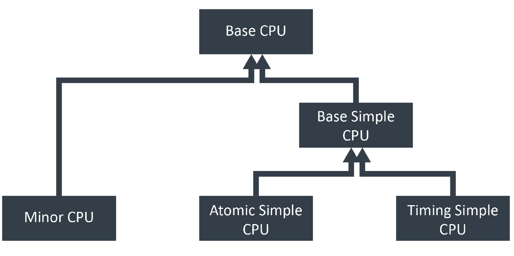
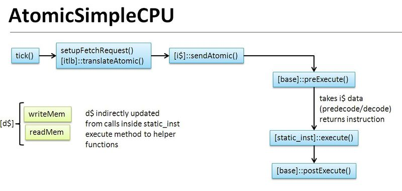
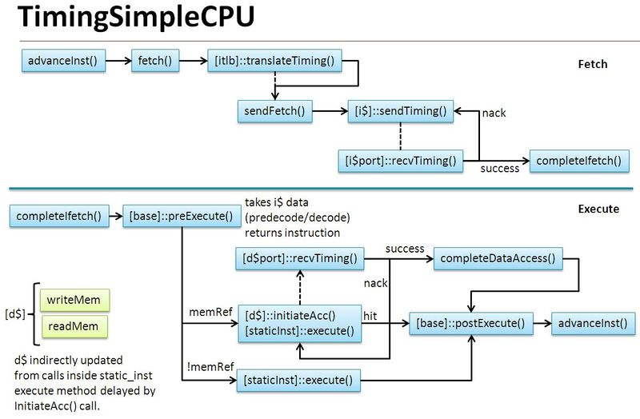
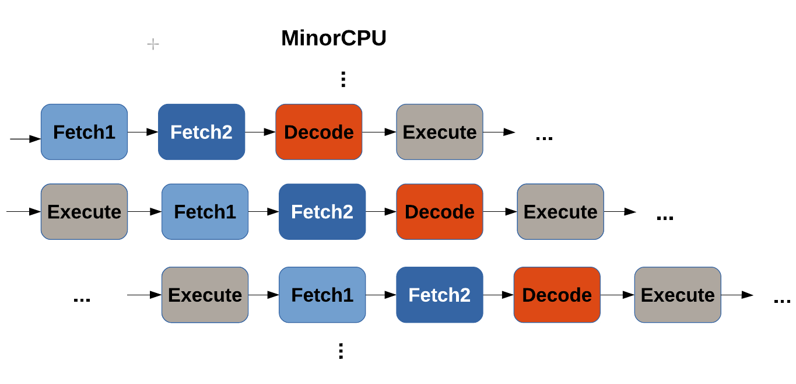

# ARM-gem5-Intro
1st project for computer architecture lab<br/>


## Introduction
The main page about gem5 simulator we can be found [here](http://www.gem5.org/Main_Page) <br/>
Please see [here](http://www.gem5.org/Dependencies), for details about dependencies. You will need to follow this software, in order to build gem5 simulator. <br/>
When you have all dependencie, in oder to build gem5 sse [here](http://www.gem5.org/Build_System).<br/><br/>

This repository refers to ARM architecture, as a result you need a cross compiler to make executables for ARM architecture.<br/><br/>

###### Commmands to install gcc and g++ compilers 
```console
$ sudo apt install gcc-arm-linux-gnueabihf
```

```console
$ sudo apt install g++-arm-linux-gnueabihf
```
###### Build command  
```console
$ arm-linux-gnueabihf-gcc --static myprog.c -o myprog_arm

```


## Answers to questions
### _1. starter_se.py simulation script_
#### SE Simulation
##### Run a simple SE
```console
$ ./build/ARM/gem5.opt -d hello_result configs/example/arm/starter_se.py --cpu="minor" "tests/test-progs/hello/bin/arm/linux/hello"
```

[starter_se.py](https://github.com/sportokalidis/arm-gem5-intro/blob/master/part1/starter_se.py): is a simulation python script which defines system parameters<br/><br/>

in **_main_** function (lines: 187-208):
```python
    parser = argparse.ArgumentParser(epilog=__doc__)

    parser.add_argument("commands_to_run", metavar="command(s)", nargs='*',
                        help="Command(s) to run")
    parser.add_argument("--cpu", type=str, choices=cpu_types.keys(),
                        default="atomic",
                        help="CPU model to use")
    parser.add_argument("--cpu-freq", type=str, default="4GHz")
    parser.add_argument("--num-cores", type=int, default=1,
                        help="Number of CPU cores")
    parser.add_argument("--mem-type", default="DDR3_1600_8x8",
                        choices=ObjectList.mem_list.get_names(),
                        help = "type of memory to use")
    parser.add_argument("--mem-channels", type=int, default=2,
                        help = "number of memory channels")
    parser.add_argument("--mem-ranks", type=int, default=None,
                        help = "number of memory ranks per channel")
    parser.add_argument("--mem-size", action="store", type=str,
                        default="2GB",
                        help="Specify the physical memory size")
                        
    args = parser.parse_args()
```

[starter_se.py](https://github.com/sportokalidis/arm-gem5-intro/blob/master/part1/starter_se.py) defines default **cpu** and **memory** parameters, however user can puts these parameters as arguments in run command
###### NOTE: in simple SE run command we define cpu model as Minor *(--cpu="Minor")* <br/><br/>
several **cpu models** define in lines 69-79 in this map data stucture:
```python
    cpu_types = {
        "atomic" : ( AtomicSimpleCPU, None, None, None, None),
        "minor" : (MinorCPU,
                   devices.L1I, devices.L1D,
                   devices.WalkCache,
                   devices.L2),
        "hpi" : ( HPI.HPI,
                  HPI.HPI_ICache, HPI.HPI_DCache,
                  HPI.HPI_WalkCache,
                  HPI.HPI_L2)
    }
```


In addition, in class ***SimpleSeSystem*** (lines: 82-141):<br/>
in line 88, define **cache line size**
```python
    # Use a fixed cache line size of 64 bytes
    cache_line_size = 64
```
in lines 99-100, defines **voltage** and **clock**
```python
    self.voltage_domain = VoltageDomain(voltage="3.3V")
    self.clk_domain = SrcClockDomain(clock="1GHz",voltage_domain=self.voltage_domain)
```

---
### _2. Verification of simulation configs_
#### gem5 output:
***config.ini:*** Dumps all of the parameters of all SimObjects (modules). This shows exactly what you simulated<br/>
***config.json:*** Same as config.ini, but in json format.<br/>
***stats.txt:*** Detailed statistic output. Each SimObject defines and updates statistics. They are printed here at the end of               semulation<br/><br/>
By default, the output send this three files in **m5out** file. In our command, we send the output files in **hello_result** file (this accepted with the flag **-d path** in run command)

#### Verification of first part answer
[stats.txt](https://github.com/sportokalidis/arm-gem5-intro/blob/master/part1/part1_results/stats.txt)<br/>
[config.ini](https://github.com/sportokalidis/arm-gem5-intro/blob/master/part1/part1_results/config.ini)<br/>
[config.json](https://github.com/sportokalidis/arm-gem5-intro/blob/master/part1/part1_results/config.json)<br/><br/>

In file ***config.ini:***<br/>
    
  **->** line 67: `type=MinorCPU` (CPU model)<br/>
  **->** line 60: `clock=250` (CPU period in pico seconds)<br/>
  **->** line 15: `cache_line_size=64`(cache) <br/>
  **->** line 25: `mem_ranges=0:2147483647`(memory size 2GB)<br/>
  **->** line 46: `clock=1000` (system clock period in ticks)     


---


### _3. In-Order CPUs models_ <br/>
Gem5 provides different CPU models which suit different requirements, namely **simple CPUs**, detailed **in-order CPUs**,
detailed **out-of-order CPUs**, and **KVM-based CPUs**. In this section, we focus on the in-order CPU models provided in
gem5. We start with the simplified CPU models and the MinorCPU, which is a more realistic in-order CPU model.
The simplified CPU models are functional *in-order models* for **fast simulation**, while some of the details are ignored.
These models can be used for **simple tests**, or for **fast-forwarding** to the regions of interest during a simulation. The base class for the simplified CPU models is named **BaseSimpleCPU**, which defines basic functions for handling interrupts, fetch requests, pre-execute setup and post-execute actions. Since it implements a simplified CPU model, it simply advances to
the next instruction after executing the current one, with no instruction pipelining. In contrast, the detailed CPU models
are more realistic and certainly more time-consuming to simulate.
Here we introduce two models derived from BaseSimpleCPU, namely **AtomicSimpleCPU** and **TimingSimpleCPU**.<br/><br/>



#### Memory Access
CPU models depend on memory access and there are three types of access supported in gem5, namely **timing**, **atomic** and
**functional** methods.<br/><br/>

**Atomic access** is the fastest of the three, and completes a transaction in a single function call. It models state changes (cache fills, coherence) and calculates the approximate latency without contention or queuing delay, making it suitable
for loosely-timed simulation (fast-forwarding) or warming caches.<br/>
**Functional access** is similar to Atomic access in that it completes a transaction in a single function call and the access
happens instantaneously. Additionally, functional accesses can coexist in the memory system with Atomic or Timing
accesses. Therefore, functional accesses are suitable for loading binaries and debugging.<br/>
**Timing access** is the most realistic access method and is used for approximately-timed simulation, which considers
the realistic timing, and models the queuing delay and resource contention. Timing and Atomic accesses cannot
coexist in the system.<br/><br/><br/>

#### AtomicSimpleCPU
The *AtomicSimpleCPU* uses Atomic memory accesses. In gem5, the AtomicSimpleCPU performs all
operations for an instruction on every CPU tick() and it can get a rough estimation of overall cache access time using the
latency estimates from the atomic accesses. The AtomicSimpleCPU is derived from BaseSimpleCPU, and implements functions to read and write memory, and also to tick, which defines what happens every CPU cycle. It defines the port that is used to hook up to memory, and connects the CPU to the cache. Naturally, AtomicSimpleCPU provides the fastest functional simulation, and
is used for fast-forwarding to get to a Region Of Interest (ROI) in gem5.<br/><br/>

 <br/><br/>

#### TimingSimpleCPU
The TimingSimpleCPU adopted Timing memory access instead of the simple Atomic one.  Like the AtomicSimpleCPU, the TimingSimpleCPU is also derived from BaseSimpleCPU, and implements the same set of functions. It defines the port that is used to hook up to memory, and connects the CPU to the cache. It also defines the necessary functions for handling the response from memory to the accesses sent out. TimingSimpleCPU is also a fast-to-run model, since it simplifies some aspects including pipelining, which means that only a single instruction is being processed at any time.  Each arithmetic instruction is executed by TimingSimpleCPU in a single cycle, while memory accesses require multiple cycles.

 <br/><br/>

#### MinorCPU
Minor is an in-order processor model with a fixed pipeline but configurable data structures and execute behaviour. It is intended to be used to model processors with strict in-order execution behaviour and allows visualisation of an instruction's position in the pipeline. The intention is to provide a framework for micro-architecturally correlating the model with a particular, chosen processor with similar capabilities. MinorCPU has a fixed four-stage in-order execution pipeline, while having configurable data structures and execute behavior; therefore it can be configured at the micro-architecture level to model a specific processor. The four-stage pipeline implemented by MinorCPU includes fetching lines, decomposition into macro-ops, decomposition of macro-ops into micro-ops and execute. These stages are named Fetch1, Fetch2, Decode and Execute, respectively. The pipeline class controls the cyclic tick event and the idling (cycle skipping).<br/><br/>
 <br/><br/>

More about MinorCPU and pipeline stages [here](http://www.gem5.org/docs/html/minor.html). <br/><br/><br/>


### Part 2
#### Comparison between MinorCPU model and TimingSimpleCPU model

###### Run command for MinorCPU model

```shell
$ ./build/ARM/gem5.opt -d Results_MinorCPU configs/example/se.py --cpu-type=MinorCPU --caches --cmd=tests/test-progs/hello/bin/arm/linux/test
```

###### Run command for TimingSimpleCPU model

```shell
$ ./build/ARM/gem5.opt -d Results_TimingSimpleCPU configs/example/se.py --cpu-type=TimingSimpleCPU --caches --cmd=tests/test-progs/hello/bin/arm/linux/test
```

|stats     |  MinorCPU    |  TiminigSimpleCPU|
|----------|:------------:|-----------------:|
|sim seconds|0.000032|0.000039|   
|sim_ticks|31790000|38986000|
|final_ticks|31790000|38986000|
|sim_freq|1000000000000|1000000000000|
|sim_insts|10747|10705|
|sim_ops|12670|12589|
|system.cpu.committedOps|12670|12589|
|system.cpu.numCycles|63580|77972|

<br/>

More stats about part 2 [here](https://github.com/sportokalidis/arm-gem5-intro/tree/master/part2)

<br/><br/><br/>


### Part 3
#### Comparison between MinorCPU model and TimingSimpleCPU model when memory type is DDR4_2400_8x8

###### Run command for MinorCPU model

```shell
$ ./build/ARM/gem5.opt -d Results_MinorCPU configs/example/se.py --cpu-type=MinorCPU --caches --mem-type=DDR4_2400_8x8 --cmd=tests/test-progs/hello/bin/arm/linux/test
```

###### Run command for TimingSimpleCPU model

```shell
$ ./build/ARM/gem5.opt -d Results_TimingSimpleCPU configs/example/se.py --cpu-type=TimingSimpleCPU --caches --mem-type=DDR4_2400_8x8 --cmd=tests/test-progs/hello/bin/arm/linux/test
```


|stats     |  MinorCPU    |  TiminigSimpleCPU|
|----------|:------------:|-----------------:|
|sim seconds|0.000031|0.000039|   
|sim_ticks|30883000|38875000|
|final_ticks|30883000|38875000|
|sim_freq|1000000000000|1000000000000|
|sim_insts|221608|10705|
|sim_ops|12670|12589|
|system.cpu.committedOps|12670|12589|
|system.cpu.numCycles|61766|77750|

<br/>

More stats about part 3 [here](https://github.com/sportokalidis/arm-gem5-intro/tree/master/part3)

<br/>

In part2 and part3, the differecne between two models is located in **num of cicles**. MinorCPU model is faster because of a better iplementation of pipeline.

<br/><br/><br/>

### Part 4
#### Comparison between MinorCPU model and TimingSimpleCPU model when CPUs fequency is 3GHz and memory type is DDR4_2400_8x8   


###### Run command for MinorCPU model

```shell
$ ./build/ARM/gem5.opt -d Results_MinorCPU configs/example/se.py --cpu-type=MinorCPU --caches --cpu-clock=3GHz --mem-type=DDR4_2400_8x8 --cmd=tests/test-progs/hello/bin/arm/linux/test
```

###### Run command for TimingSimpleCPU model

```shell
$ ./build/ARM/gem5.opt -d Results_TimingSimpleCPU configs/example/se.py --cpu-type=TimingSimpleCPU --caches --cpu-clock=3GHz --mem-type=DDR4_2400_8x8 --cmd=tests/test-progs/hello/bin/arm/linux/test
```

|stats     |  MinorCPU    |  TiminigSimpleCPU|
|----------|:------------:|-----------------:|
|sim seconds|0.000029|0.000034|   
|sim_ticks|28758546|33617016|
|final_ticks|28758546|33617016|
|sim_freq|1000000000000|1000000000000|
|sim_insts|10747|10705|
|sim_ops|12670|12589|
|system.cpu.committedOps|12670|12589|
|system.cpu.numCycles|86362|100952|

<br/>

More stats about part 4 [here](https://github.com/sportokalidis/arm-gem5-intro/tree/master/part4)

<br/>

In part 4, we see that the two models has better results because of the CPUs frecuency increase.


---


### SOURCES
[1] http://www.gem5.org<br/>
[2] https://github.com/arm-university/arm-gem5-rsk<br/>
[3] http://gem5.org/SimpleCPU<br/>
[4] http://gem5.org/Documentation<br/>
[5] http://www.gem5.org/docs/html/minor.html<br/>
[6] http://pages.cs.wisc.edu/~david/courses/cs752/Fall2015/gem5-tutorial/index.html<br/>
[7] http://www.gem5.org/General_Memory_System<br/>


